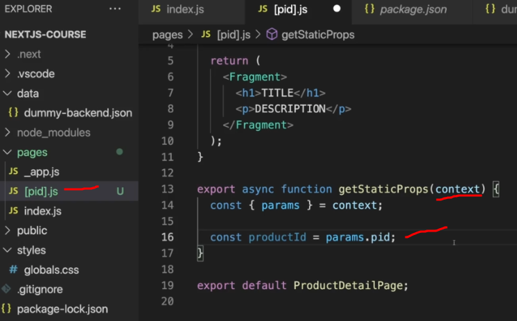
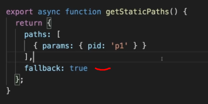

My personal quick notes for Next.js for people knowing basics of React and Node.js

Thanks to [Maximilian Schwarzmüller](https://www.udemy.com/course/nextjs-react-the-complete-guide/#instructor-1) for this awesome [Udemy Course](https://www.udemy.com/course/nextjs-react-the-complete-guide/)

<details>   
<summary>Create a next app</summary>

```sh
npx create-next-app
```

start the development server

```sh
npm run dev
```

</details>

<details> 
<summary>File Based Routing</summary>

The **pages** directory is a special directory where we can write code for each page of our website.

The pages are generated based on the directory structure.

1. For each page we can opt to create a folder/file with same name. (as shown in image)

2. index.js is special file name that will be rendered on path to it's parent directory name. Hence both of these directory structure are same and will render on **/blogs** path (only use either one of them).

   **pages/blog/index.js**

   **pages/blog.js**

3. We can also define dynamic routes with special syntax file name.

   **[dynamic].js**

   Example:

   Directories - pages/blog/[id].js

   [id].js will be rendered for url **/blog/2321/**

4. Each file should export a react component for that page.


<details><summary>How do I get the dynamic route value in my Component?</summary>

We have to use **useRouter** hook imported from next.

Example:-

The **query** property on router is a object that contains value of our dynamic route.


</details>

<details><summary>Nested Dynamic Routes</summary>

Consider the following directory structure

Let's suppose there is a client with id = 123 and project id = 456

    /clients - this will load the index.js file present inside clients folder

    /clients/123 - this will load index.js file present inside [id] folder

    /clients/123/456 - this will load the [clientprojectid].js file


</details>

<details><summary>Catch all routes</summary>
Suppose if we want to make a js file that is rendered for any path with any number of segments

Ex:-

    Suppose if we want to catch all such paths to the same file

    /blog/123
    /blog/123/456
    /blogs/123/456/789
    ...so on

For this we can create a special file inside blogs folder as shown in image. Note that the name of file can be anything but the three dots define it's a catch all route.

Also all the url segments can be accessed inside our react component using useRouter hook.


</details>

<details><summary>Clickable links for our routes</summary>

Now that we have created many routes. We have to create clickable buttons which helps us to navigate between all these routes without manually typing the routes or refreshing the page for each request.

- This can be done using the **Link** object imported from next.


The **href** in Link can accept strings for paths however for bigger apps there might be very long paths which becomes cumbersome to write in form of pure strings.

Therefore there is another way of defining href inside Link. i.e we pass an object to href instead of string. This object has necessary information to which path a link should redirect to.


This format makes it easy to handle very big or complex routes.

- Another way to declare link is this syntax. The advantage here is you can give custom styling to your anchor tag. It functions the same as above.


</details>

 <details><summary>How to navigate programatically?</summary>
 
 This can be done easily with **useRouter** hook. 
 
 And just like **Link** here also we can pass either a string or an object to the path we want to navigate
 
 
 
 
 
 </details>
 
 <details><summary>404 Page</summary>
 This page is a specially named page which is rendered when user try to visit a non-existing route. 
 
 This is a special file and must be present inside pages folder with same name.
 
 
 
 </details>
 
 **NOTE:-**
 
 The order of preference for the routes is
 
 	index.js > [dynamic].js > [...dynamic].js

</details>

<details> 
<summary>Regular React Components</summary>

Now that our routes are ready. We have to create react components that are not reachable from the routes but are used inside our app, these components are called regular components.

These components can be placed anywhere outside the **pages** folder. Prefreably create a folder named **components** parallel to our pages folder.


The folder name is up to you and here you can place your regular components.

</details>

 <details><summary>Pre-Fetching and Pre-Rendering</summary>
 
 This is where we solve the problem realted to SEO by building the page on server itself.
 
 Types of Pre-Rendering
 
 - Static Generation
 - Server-side Rendering
 - Hybrid of above two

 <details><summary>Static Generation</summary> 
 
Here a static page is generated on **build time itself**.

- This process is done only once during build process.

**Advantage**

- The static build pages are fully functional with react hence behave just like a normal react app.

- These static pages can be easily cached by CDN which improves performance.

**Disadvantage**

- Since the page is generated only once. The server will never create a new build of this pages. So if we require to update this page in future for some reason, we need to rebuild our next app and redeploy.

So overall this type of generation is good for pages that do not ever change in long run.

 <details><summary>getStaticProps</summary>
 
 To do static generation of a page we need to export this function from our **page components**.
 
 
 
 Note:-
 
 - The code written inside this function is not shipped to the client. Hence the code inside getStaticProps function is ran during the build process and not on the client side.
 
 - Basically inside this function we write backend code and not frontend code. 
 
 **How to use getStaticProps function?**
 
 getStaticProps function is supposed to return and object with a key props. Anything inside the props key will be passed to our react component for our use.
 
 
 
 As I said earlier we can write node js code inside getStaticProps function, we can import node js modules such as fs,path etc that is not accessible in frontend code.
 
 So in more practical case of above example, we would like to fetch data from some local directory for which we require js module.
 
 
 
 so in this case we can see we are importing fs and path module that can't be used in frontend code but inside getStaticProps function to fetch data from some local json file.

**Special Note:-**

In case we are unable to load the required data (due to some error) and want to show 404 page. We can simple return this object from getStaticProps function.

```
    {notFound: true}
```

  <details><summary>Incremental Static Generation (ISR)</summary>
 
 The flaw of above method was the page is generated only once during build time. However next has fix for that as well. 
 
We can generate the static page for every request we get and we can set time also before which static page should not be generated.

To use this feature we have to set another property in return object of getStaticProps function i.e **revalidate**.


In the above code revalidate value is set to 10. This means if a request comes after 10 seconds has been passed since the last regeneration of page, The server will generate a new static page and give it to the user.

 </details>
 
  <details><summary>More about getStaticProps</summary>

In the return object we can set a few more values.


- notFound

This is a boolean value you can set to true incase something goes wrong and you want to show 404 page to user.

- redirect

This is an object specifying the path to which user should be redirected incase we want the user to go to some other page based on situation.

 </details>

  <details><summary>What is context in getStaticProps?</summary>
  
  The context object helps us to get the url parameters.



  </details>

  <details><summary>How to statically generate [dynamic].js pages?</summary>
  
  Since this is a dynamic page. There will be many values for **dynamic** hence to generate this page statically, we need to generate each a page for each possible value of **dynamic**.

Hence we need to tell next js in advance all the possible values of **dynamic** so that next can generate static page for each. This can be done using **getStaticPaths** function.


Example:-

getStaticPaths function should return an object with a key set to params. This params key should contain an array of object and each of these objects represent one possible params.(see example to be more clear)


**What is fallback?**

In practical case there might be a huge number of dynamic routes and it is very impractical to generate a static page for each of those.

In those cases we can set fallback to true. What this will do is, It will generate the page **just in time** for the paths not mentioned in paths parameter.

Example:-

;

Here in this case a static page will will be generated only for **p1** and for any other param, page will be generated just in time on server.

Note:- if you set fallback to true, you must also add a fallback check to make sure data is ready before being used.

With fallback check you can serve some content to user before loading actual data.


**hence in practical case statically generate only the highly visited pages and leave the rest**

Note:-

    fallback: 'blocking'

fallback can also be set to blocking if you don't want fallback check which in this case will take a bit long for page to load since server will generate the page before serving it to the user and no pre-static data will be shown to user since we don't have any fallback check here.

  </details>
 
 
  <details><summary>Automatic Static Generation?</summary>
 
 For pages that do not contain any dynamic data. Nextjs will smartly do static generation of that page without us doing anything. 
 
 </details>
 
 </details>

  </details>
 <details><summary>Server Side Rendering</summary>
 
 In server side rendering the page will be generated for each request just in time and we will also have access to the **request** object which we didn't had in static generation.

For this we will use the **getServerSideProps** function


Note - in a single page either use static page generation or use server side rendering but not both.

The usage format of getServerSideProps is same as getStaticProps. Here also we have to return an object that contains props, we can use context and all other thing except for revalidate key. There is no such concept here since page is built for each request.

<details><summary>How to get request and response object?</summary>

We can get these object from the context.


</details>

 <details><summary>Server Side Rendering for [dynamic].js pages</summary>

Here there is no concept of similar to getStaticPaths.

Just use getServerSideProps the same way.

</details>

 </details>
  </details>

<details> 
<summary>Client Side Data Fetching</summary>

Now we have seen a lot about server side data fetching and pre-rendering then why do we still need client side data fetching?

For data that is highly dynamic/highly specific it's impractical to pre-build it at server and better to get it on the client side.


There is nothing new here, it's very same as how you do api calls in react.

**Generally server side data fetching is combined with client side rendering so that user is given some data on the first load and later that data is overridden by latest data.**

</details>

<details><summary>Optimizing NextJs Apps</summary>

Here we will add meta data for crawlers to read.

NextJs provides us some special components fro this purpose.

## Head

To insert content into the head of a page, we can use **Head** which can be imported from next.

Now we can add title and meta data to the page.


## _document.js

We can add extra data to our whole page inside the _document.js. This file is not present by default and should be created by us.


Inside this we can set extra properties to the page such as lang,overlay.

## Optimizing Images

We can import a special image component from image

```js
import Image from "next/image";
``` 

This image component allows us to specify the expected resolution of an image and convert that image to webp format so that size can be reduced significantly. 

Plus this enables lazy loading for the image.

- check the docs for more properties for image optimization. 


</details>